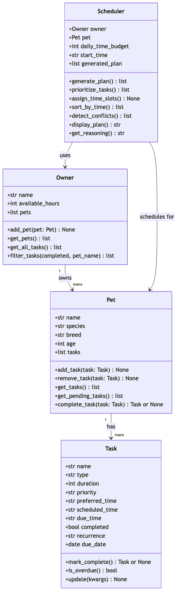

# PawPal+ (Module 2 Project)

**PawPal+** is a Python-backed Streamlit app that helps a busy pet owner plan daily care tasks across multiple pets. It sorts, filters, and schedules tasks based on priority and time constraints, detects scheduling conflicts, and automatically re-queues recurring tasks.

---

## Features

- **Priority-based scheduling** — Tasks are ranked `high → medium → low` and packed into the owner's available time budget. `Scheduler.prioritize_tasks()` uses a two-key sort: priority level first, then `preferred_time` as a tiebreaker.

- **Chronological sorting** — `Scheduler.sort_by_time()` returns the generated plan ordered from earliest to latest using a `sorted()` lambda key. Zero-padded `"HH:MM"` strings sort correctly as plain strings — no `datetime` parsing needed.

- **Task filtering** — `Owner.filter_tasks(completed, pet_name)` returns `(Pet, Task)` pairs matching any combination of completion status and pet name. Both parameters are optional; omitting one skips that filter entirely.

- **Conflict detection** — `Scheduler.detect_conflicts()` checks every pair of scheduled tasks for interval overlap using the arithmetic condition `a_start < b_end and b_start < a_end`. Returns a list of plain-English warning strings — never raises — so the UI can display them safely.

- **Recurring tasks** — Tasks can be set to `"daily"` or `"weekly"` recurrence. When `Pet.complete_task(task)` is called, `Task.mark_complete()` uses Python's `timedelta` to advance the `due_date` by 1 or 7 days and returns a fresh task instance. `complete_task()` auto-appends it to the pet's list so it shows up in the next generated plan automatically.

- **Reasoning output** — `Scheduler.get_reasoning()` explains, in plain text, why each task was placed at its time slot and names any tasks that were skipped due to the time budget.

---

## Getting Started

### Setup

```bash
python -m venv .venv
source .venv/bin/activate  # Windows: .venv\Scripts\activate
pip install -r requirements.txt
```

### Run the Streamlit app

```bash
streamlit run app.py
```

### Run the CLI demo

```bash
python main.py
```

---

## 🧪 Testing PawPal+

```bash
# Run the full test suite:
pytest

# Run with coverage:
pytest --cov
```

---

## 📐 Smarter Scheduling

| Feature | Method(s) | Notes |
|---------|-----------|-------|
| Task sorting | `Scheduler.sort_by_time()` | Sorts by `scheduled_time` using a lambda key; zero-padded `"HH:MM"` strings compare correctly without parsing |
| Priority sorting | `Scheduler.prioritize_tasks()` | Sorts pending tasks by priority level (`high → medium → low`), then by `preferred_time` as a tiebreaker |
| Filtering | `Owner.filter_tasks(completed, pet_name)` | Returns `(Pet, Task)` pairs; both params are optional — omit either to skip that filter. Pet name match is case-insensitive |
| Conflict detection | `Scheduler.detect_conflicts()` | Checks every scheduled pair for interval overlap (`a_start < b_end and b_start < a_end`); returns warning strings, never raises |
| Recurring tasks | `Task.mark_complete()`, `Pet.complete_task()` | `mark_complete()` returns the next `Task` with `due_date` advanced by `timedelta`; `complete_task()` auto-appends it to the pet's task list |

### Sorting

`Scheduler.sort_by_time()` returns a new list of the generated plan's tasks ordered from earliest to latest `scheduled_time`. It uses Python's `sorted()` with a lambda key:

```python
sorted(tasks, key=lambda t: t.scheduled_time)
```

Because `scheduled_time` is always zero-padded `"HH:MM"`, string comparison is equivalent to chronological comparison — no `datetime` parsing needed. The original `generated_plan` is not modified.

### Filtering

`Owner.filter_tasks(completed, pet_name)` scans every task across all pets and returns only the `(Pet, Task)` pairs that match the supplied filters:

```python
owner.filter_tasks(completed=False)                   # all pending tasks, all pets
owner.filter_tasks(pet_name="Biscuit")                # all tasks for one pet
owner.filter_tasks(completed=True, pet_name="Mochi")  # Mochi's completed tasks
```

Both parameters default to `None`, which means "no filter". The method searches `pet.tasks` directly (not `get_pending_tasks()`) so `completed=True` correctly surfaces finished tasks.

### Conflict Detection

`Scheduler.detect_conflicts()` compares every pair of scheduled tasks using integer interval arithmetic. Each `"HH:MM"` time is converted to total minutes; two tasks conflict when:

```
a_start < b_end  and  b_start < a_end
```

The method returns a list of human-readable warning strings — one per conflicting pair — and returns an empty list when the plan is clean. It never raises, so callers can safely print results without extra guards.

### Recurring Tasks

Tasks carry a `recurrence` field (`"daily"` or `"weekly"`) and a `due_date`. When `Pet.complete_task(task)` is called:

1. `task.mark_complete()` sets `completed = True` and, for recurring tasks, uses `timedelta` to compute the next due date:
   - `"daily"` → `due_date + timedelta(days=1)`
   - `"weekly"` → `due_date + timedelta(days=7)`
2. A fresh `Task` (identical fields, `completed=False`, `scheduled_time=None`, updated `due_date`) is returned.
3. `complete_task()` appends that new task to the pet's list automatically.

Adding a new recurrence interval requires only one line in the `RECURRENCE_DAYS` dict at the top of `pawpal_system.py`.

---

## 📸 Demo Walkthrough

### Streamlit UI

Open the app with `streamlit run app.py`, then:

1. **Enter owner info** — Type the owner's name and set available hours for the day (e.g. "Alex", 3 hours).
2. **Enter pet info** — Set the pet's name, species, and breed (e.g. "Biscuit", Dog, Golden Retriever).
3. **Add tasks** — For each task, fill in the name, type, duration, priority, preferred time, and recurrence. Click **➕ Add task**. The task table updates immediately.
4. **Generate the schedule** — Click **📅 Build today's plan**. The scheduler sorts tasks by priority, fits them within the time budget, and displays:
   - A green **"No conflicts"** banner if all time slots are clean, or a red error with yellow per-conflict warnings if any tasks overlap.
   - A **sorted schedule table** (via `sort_by_time()`) showing each task's assigned time, type, duration, priority, recurrence, and status.
   - A collapsible **"Why was the plan built this way?"** expander with the reasoning for each slot.
5. **Filter tasks** — Use the **Task Filter** radio buttons (`All / Pending only / Completed only`) to query tasks via `filter_tasks()`. Results update live in a second table showing due date and recurrence status.

**Example workflow:**
```
Add "Morning walk"  — 30 min, high priority,  08:00
Add "Breakfast"     — 10 min, high priority,  08:30, daily recurrence
Add "Evening walk"  — 30 min, medium priority, 17:00
→ Click "Build today's plan"
→ Green banner: No conflicts — this plan is ready to follow!
→ Table shows tasks sorted 08:00 → 08:30 → 08:40
→ Reasoning: each task placed because of its priority and preferred time
→ Filter "Pending only" to see only tasks not yet completed
```

---

### CLI Demo (`python main.py`)

```
=============================================
       TODAY'S SCHEDULE FOR ALEX
=============================================

Daily plan for Biscuit (Golden Retriever):
  08:00 — Morning walk (30 min) [priority: high]
  08:30 — Breakfast (10 min) [priority: high]
  08:40 — Flea medication (5 min) [priority: medium]
  08:45 — Evening walk (30 min) [priority: medium]

Reasoning for Biscuit's plan:
  1. 'Morning walk' scheduled at 08:00 because it has high priority and preferred time 08:00.
  2. 'Breakfast' scheduled at 08:30 because it has high priority and preferred time 08:30.
  3. 'Flea medication' scheduled at 08:40 because it has medium priority and preferred time 09:00.
  4. 'Evening walk' scheduled at 08:45 because it has medium priority and preferred time 17:00.
---------------------------------------------

Daily plan for Mochi (Scottish Fold):
  08:00 — Breakfast (5 min) [priority: high]
  08:05 — Playtime (20 min) [priority: medium]
  08:25 — Grooming (15 min) [priority: low]

Reasoning for Mochi's plan:
  1. 'Breakfast' scheduled at 08:00 because it has high priority and preferred time 08:00.
  2. 'Playtime' scheduled at 08:05 because it has medium priority and preferred time 11:00.
  3. 'Grooming' scheduled at 08:25 because it has low priority and preferred time 10:00.
---------------------------------------------

=============================================
      SORT BY TIME DEMO
=============================================

Biscuit's tasks sorted chronologically:
  08:00 — Morning walk (high)
  08:30 — Breakfast (high)
  08:40 — Flea medication (medium)
  08:45 — Evening walk (medium)

=============================================
      FILTER TASKS DEMO
=============================================

All incomplete tasks (all pets):
  [Biscuit] Evening walk — medium
  [Biscuit] Flea medication — medium
  [Biscuit] Breakfast — high
  [Biscuit] Morning walk — high
  [Mochi] Playtime — medium
  [Mochi] Breakfast — high
  [Mochi] Grooming — low

Biscuit's incomplete tasks only:
  Evening walk
  Flea medication
  Breakfast
  Morning walk

=============================================
      RECURRENCE DEMO
=============================================

Before: Biscuit has 4 task(s)
Completed 'Morning walk' — was due 2026-07-04 (recurrence=daily)
After:  Biscuit has 5 task(s)
  -> Next occurrence: 'Morning walk' due 2026-07-05 (today + 1 day via timedelta)

Completed 'Playtime' — was due 2026-07-04 (recurrence=weekly)
  -> Next occurrence: 'Playtime' due 2026-07-11 (today + 7 days via timedelta)

Mochi's pending tasks after completions:
  Grooming
  Breakfast [daily] due 2026-07-05
  Playtime [weekly] due 2026-07-11

=============================================
      CONFLICT DETECTION DEMO
=============================================

Rex's manually scheduled tasks:
  09:00 — Bath time (30 min)
  09:15 — Vet checkup (45 min)
  12:00 — Lunch (10 min)

WARNING: 'Bath time' (09:00, 30 min) overlaps with 'Vet checkup' (09:15, 45 min) for Rex

No-conflict check (Biscuit's auto-generated plan):
  No conflicts detected — Biscuit's plan is clean.
```

---

## 🎨 CLI Formatting

The CLI output (`python main.py`) uses two libraries — `tabulate` and `colorama` — through a dedicated helper module at `formatting.py`.

| Feature | Library | Function | What it does |
|---------|---------|----------|--------------|
| Structured tables | `tabulate` | `format_schedule_table()` | Renders each pet's schedule as a `rounded_outline` bordered table with Time, Task, Duration, Priority, and Recurs columns |
| Filter results | `tabulate` | `format_filter_table()` | Renders `Owner.filter_tasks()` results as a table with Pet, Task, Priority, Recurs, Due date, and Status columns |
| Color-coded priority | `colorama` | `priority_badge()` | HIGH = red, MEDIUM = yellow, LOW = green using `Fore.*` constants |
| Conflict warnings | `colorama` | `format_conflict_warnings()` | Red `⚠` with bullet lines for conflicts; green `✅` when the plan is clean |
| Recurrence events | `colorama` | `format_recurrence_event()` | Green `✓` for completed task + cyan `↻` arrow pointing to the next occurrence date |
| Section headers | `colorama` | `section_header()` | Bold cyan `=` bars around each demo section title |
| Task type emojis | built-in dict | `task_emoji()` | Maps task types to emojis: 🦮 walk, 🍽️ feeding, 💊 meds, ✂️ grooming, 🎾 enrichment, 🏥 medical |

All formatting functions live in `formatting.py` and accept plain data — they have no imports from `pawpal_system.py`, so the core scheduling logic stays completely independent of display concerns.

## 🗂 Project Structure

```
pawpal_system.py   # Core classes: Task, Pet, Owner, Scheduler
app.py             # Streamlit UI
main.py            # CLI demo exercising all scheduler features
tests/             # pytest test suite
diagrams/          # UML source (uml_final.mmd) and exported PNG
```

## 📐 UML Diagram


